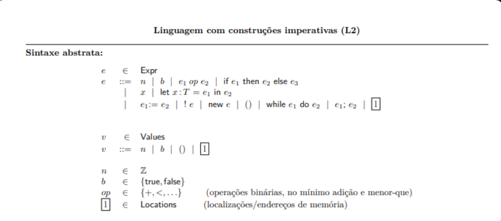
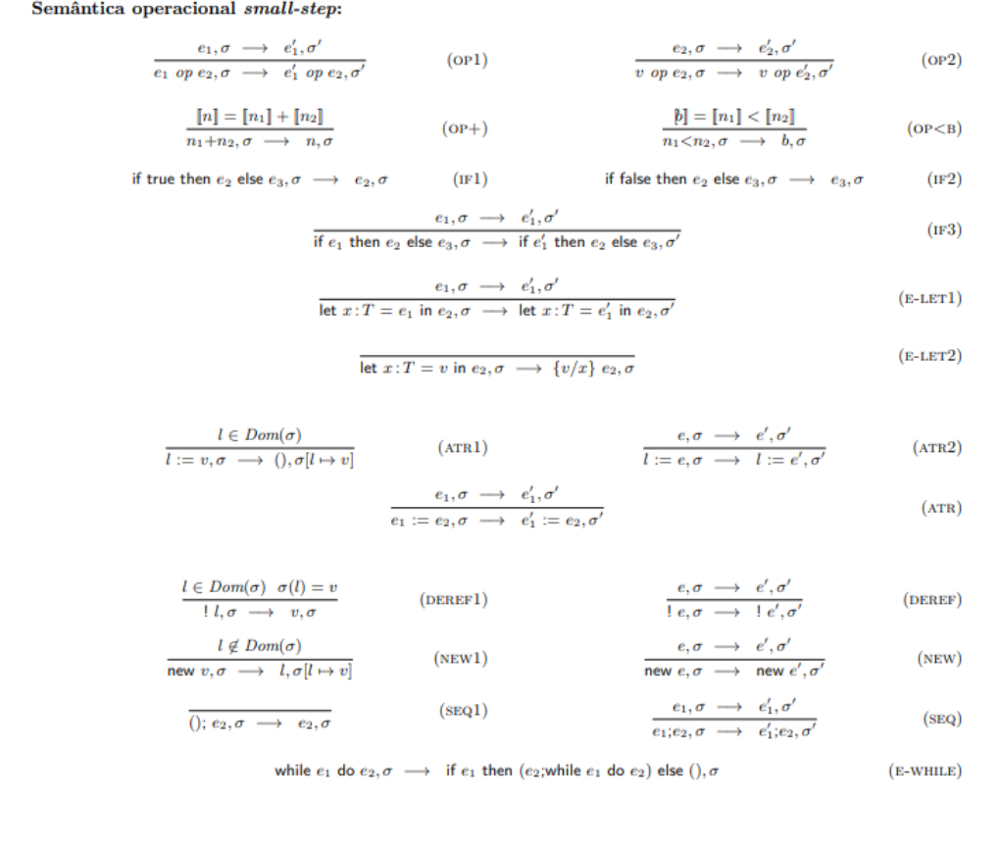
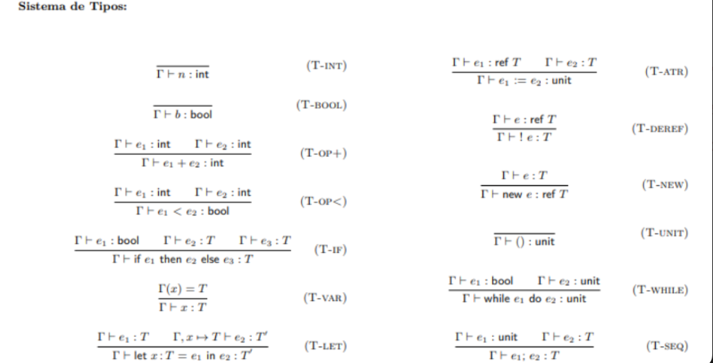

# Enunciado L2

Esta pagina concentra as imagens de referencia do enunciado da linguagem L2 usadas para orientar a implementacao.

## Sintaxe Abstrata

## Semantica Operacional Small-Step

## Sistema de Tipos

